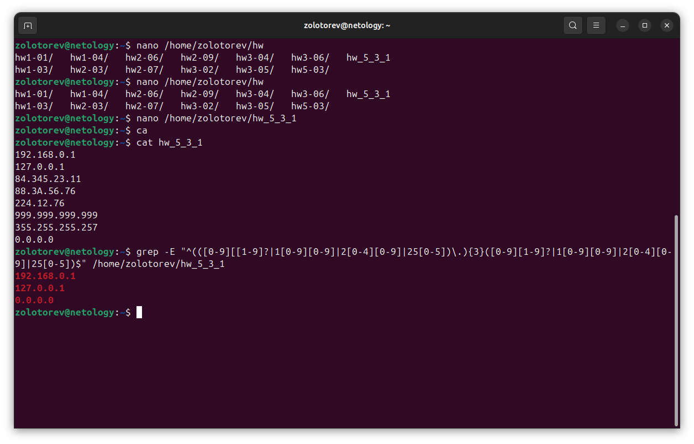

# Домашнее задание к занятию "Regexp и его использование для синтаксического анализа"

### Золоторев Н.Д.

### Задание 1

Напишите регулярное выражение для проверки является ли строка IPv4 адресом.

Для тестов можно использовать файл со следующим содержимым, фильтруя вывод с помощью команды grep -E:

192.168.0.1
127.0.0.1
84.345.23.11
88.3A.56.76
224.12.76
999.999.999.999
355.255.255.257
0.0.0.0

Пришлите получившееся выражение в качестве ответа.

### Решение 1

grep -E "^(([0-9][[1-9]?|1[0-9][0-9]|2[0-4][0-9]|25[0-5])\.){3}([0-9][1-9]?|1[0-9][0-9]|2[0-4][0-9]|25[0-5])$" /home/zolotorev/hw_5_3_1

### Задание 2

В Вашей конфигурации Nginx скопилось много неиспользуемых сегментов и становится сложно его читать.
Используя sed удалите все пустые строки и комментарии в конфигурации Nginx.
Попробуйте сделать это одним запуском.
Пришлите получившуюся команду в качестве ответа.

#user  nobody;
worker_processes  1;

#error_log  logs/error.log;
#error_log  logs/error.log  notice;
#error_log  logs/error.log  info;

#pid        logs/nginx.pid;

events {
    worker_connections  1024;
}

http {
    include       mime.types;
    default_type  application/octet-stream;

    #log_format  main  '$remote_addr - $remote_user [$time_local] "$request" '
    #                  '$status $body_bytes_sent "$http_referer" '
    #                  '"$http_user_agent" "$http_x_forwarded_for"';

    #access_log  logs/access.log  main;

    sendfile        on;
    #tcp_nopush     on;

    #keepalive_timeout  0;
    keepalive_timeout  65;

    #gzip  on;

    server {
        listen       80;
        server_name  localhost;

        #charset koi8-r;

        #access_log  logs/host.access.log  main;

        location / {
            root   html;
            index  index.html index.htm;
        }

        #error_page  404              /404.html;

        # redirect server error pages to the static page /50x.html
        #
        error_page   500 502 503 504  /50x.html;
        location = /50x.html {
            root   html;
        }

        # proxy the PHP scripts to Apache listening on 127.0.0.1:80
        #
        #location ~ \.php$ {
        #    proxy_pass   http://127.0.0.1;
        #}

        # pass the PHP scripts to FastCGI server listening on 127.0.0.1:9000
        #
        #location ~ \.php$ {
        #    root           html;
        #    fastcgi_pass   127.0.0.1:9000;
        #    fastcgi_index  index.php;
        #    fastcgi_param  SCRIPT_FILENAME  /scripts$fastcgi_script_name;
        #    include        fastcgi_params;
        #}

        # deny access to .htaccess files, if Apache's document root
        # concurs with nginx's one
        #
        #location ~ /\.ht {
        #    deny  all;
        #}
    }

    # another virtual host using mix of IP-, name-, and port-based configuration
    #
    #server {
    #    listen       8000;
    #    listen       somename:8080;
    #    server_name  somename  alias  another.alias;

    #    location / {
    #        root   html;
    #        index  index.html index.htm;
    #    }
    #}

    # HTTPS server
    #
    #server {
    #    listen       443 ssl;
    #    server_name  localhost;

    #    ssl_certificate      cert.pem;
    #    ssl_certificate_key  cert.key;

    #    ssl_session_cache    shared:SSL:1m;
    #    ssl_session_timeout  5m;

    #    ssl_ciphers  HIGH:!aNULL:!MD5;
    #    ssl_prefer_server_ciphers  on;

    #    location / {
    #        root   html;
    #        index  index.html index.htm;
    #    }
    #}

}

### Решение 2

sed -E '/^\s*#/d;/^$/d'

### Задание 3

Задание 3.

Используя awk и ps aux соберите информацию о:

    количестве процессов для каждого пользователя;
    процессе с самым большим PID;
    (дополнительное задание со звездочкой*) суммарном использовании памяти различными пользователями.

Пришлите скриншоты со скриптами и демонстрацией их работы.

### Решение 3

